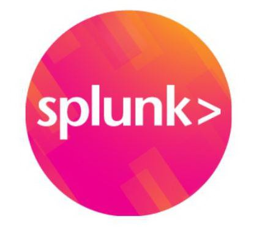
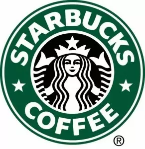

 

<table>
 <tr>
      <td><b>(510)512-5323</b></td> 
      <td><b>job@mayel.info</b></td> 
      <td>
         <a href="https://www.linkedin.com/in/mayelespino/">
             <b>LinkedIn Profile</b>
         </a>
       </td>
       <td>
           <button onclick="window.print()">Print this page</button>
       </td>
       <td>
         <a href="https://mayelespino.github.io">
         Regular version
         </a>
     </td>

</tr>
</table>

# Highlights

* Received award for [Microsoft patent submission](images/patent-award.JPG). The pattent application number is [20200184026](https://appft.uspto.gov/netacgi/nph-Parser?Sect1=PTO2&Sect2=HITOFF&p=1&u=%2Fnetahtml%2FPTO%2Fsearch-bool.html&r=1&f=G&l=50&co1=AND&d=PG01&s1=Mayel.IN.&OS=IN/Mayel&RS=IN/Mayel).
* Received 2 applause awards at Symantec
* Inventor of 6 patents: [8,849,892](http://patft.uspto.gov/netacgi/nph-Parser?Sect1=PTO2&Sect2=HITOFF&p=1&u=%2Fnetahtml%2FPTO%2Fsearch-bool.html&r=2&f=G&l=50&co1=AND&d=PTXT&s1=mayel.INNM.&OS=IN/mayel&RS=IN/mayel) -
[8,307,378](http://patft.uspto.gov/netacgi/nph-Parser?Sect1=PTO2&Sect2=HITOFF&p=1&u=%2Fnetahtml%2FPTO%2Fsearch-bool.html&r=3&f=G&l=50&co1=AND&d=PTXT&s1=mayel.INNM.&OS=IN/mayel&RS=IN/mayel) -
[8,140,980](http://patft.uspto.gov/netacgi/nph-Parser?Sect1=PTO2&Sect2=HITOFF&p=1&u=%2Fnetahtml%2FPTO%2Fsearch-bool.html&r=4&f=G&l=50&co1=AND&d=PTXT&s1=mayel.INNM.&OS=IN/mayel&RS=IN/mayel) -
[8,015,574](http://patft.uspto.gov/netacgi/nph-Parser?Sect1=PTO2&Sect2=HITOFF&p=1&u=%2Fnetahtml%2FPTO%2Fsearch-bool.html&r=5&f=G&l=50&co1=AND&d=PTXT&s1=mayel.INNM.&OS=IN/mayel&RS=IN/mayel) -
[7,783,593](http://patft.uspto.gov/netacgi/nph-Parser?Sect1=PTO2&Sect2=HITOFF&p=1&u=%2Fnetahtml%2FPTO%2Fsearch-bool.html&r=6&f=G&l=50&co1=AND&d=PTXT&s1=mayel.INNM.&OS=IN/mayel&RS=IN/mayel) -
[7,243,355](http://patft.uspto.gov/netacgi/nph-Parser?Sect1=PTO2&Sect2=HITOFF&p=1&u=%2Fnetahtml%2FPTO%2Fsearch-bool.html&r=7&f=G&l=50&co1=AND&d=PTXT&s1=mayel.INNM.&OS=IN/mayel&RS=IN/mayel)
* co-inventor of 1 patent: [9,661,142](http://patft.uspto.gov/netacgi/nph-Parser?Sect1=PTO2&Sect2=HITOFF&p=1&u=%2Fnetahtml%2FPTO%2Fsearch-bool.html&r=1&f=G&l=50&co1=AND&d=PTXT&s1=mayel.INNM.&OS=IN/mayel&RS=IN/mayel)
* My team won the first place in CQES first “hack-a-thon” at PayPal
* Received the “PayPalian” award for the Airlines Project

# Skill Set

## Programming languages

<table>
 <tr>
  <td><b>C</b></td>
  <td>15 years</td>
  <td><b>C++</b></td>
  <td>12 years</td>
  <td><b>Python</b></td>
  <td>7 years</td>
  <td><b>GO</b></td>
  <td>1 year</td>
  <td><b>C#</b></td>
  <td>1 year</td>
 <td><b>Rust</b></td>
  <td>Learning</td>
 </tr>
</table>

## Infrastructure

<table>
 <tr>
  <td><b>Configuration management</b></td>
  <td>05 years</td>
  <td><b>Cloud computing</b></td>
  <td>5 years</td>
 </tr>
 </table>
 
## Databases
 
 <table>
 <tr>
  <td><b>Relational data bases: Oracle, Sybase, MySQL</b></td>
  <td>10 years</td>
  <td><b>NoSQL Databases: Cassandra, Mongo, Graph databases</b></td>
  <td>04 years</td>
 </tr>
</table>

## Operating Systems

<table>
 <tr>
  <td><b> Linux</b></td>
  <td>14 years</td>
  <td><b>Unix</b></td>
   <td>11 years</td>
   <td><b>MVS</b></td>
   <td>04 years</td>
   <td><b>Windows</b></td>
   <td>7 years</td>
  </tr>
</table>

## Other

<table>
  <tr>
  <td><b>Middleware: Tuxedo, MQSeries, Azure Event hub</b></td>
  <td>04 years</td>
  <td><b>Project lead and management</b></td>
  <td>07 years</td>
 </tr>
 <tr>
  <td><b>PHP</b></td>
  <td>learning</td>
  <td><b>Internet security</b></td>
  <td>2 years</td>
 </tr>
 </table>

# Experience

<table>
  <tr>
   <td></td>
   <td><B>Splunk</B></td>
   <td><B>June 2022 to August 2022</B></td>
  </tr>
</table>

`Cloud access team:` This team provides the tools and infrastructure for the internal Cloud security team.

  * Created a serverless microservice to modify user accounts for returning employees.

`GO, Python, AWS`

<table>
  <tr>
   <td></td>
   <td><B>Starbucks</B></td>
   <td><B>April 2022 to June 2022</B></td>
  </tr>
</table>

`Digital Platform Customer Engangement` : Updated code used in Starbuck's cloud services for mobile applications. 

`c# and .NET`

<table>
  <tr>
   <td></td>
   <td><B>Microsoft</B></td>
   <td><B>February 2018 to April 2022</B></td>
  </tr>
</table>

`Office of the CTO` : This team designs, promotes, implements common solutions accross the Azure organization by collaborating with varios teams with in the organization.

__Process and Data analytics__ I analized the code base, the call stack and the data produced by various services to obtain information needed to create reports, alerting and monitoring tools.
 __System design and proof of concept implementation__ In varions projects our team's role was to implememt common solutions accross the Azure organization . As part of that effort, I participated in the design and develop a minimal viable productof the solutions that we proposed and co-developed with and for various teams with in Azure. In some cases we implemented the complete solution and handed ownership to on of the partner teams.

 `FleetProcess engineering`: This team was created to find solve gaps in: Our processes and tools used to manage/track Azure's hardware assets around the world. 
 
 __Computing System Simulation And Testing Environment__ Ideated, designed and implemented the minimal viable product for a tool used to model computationally processes, data flows, services and their complex relationships. 
 __Asset traceability__ I participated in the development of tools and services which improved the traceability of assets across Azure. 

`c#, Gremlin, GraphDB, AKWS, Go, Python, Kusto`

<table>
  <tr>
   <td><B>Apple</B></td>
   <td><B>April 2016 to December 2017</B></td>
  </tr>
</table>

`Software engineer - AML Infrastructure Engineering` : As part of the team I helped managed and maintain a large infrastructure to serve field diagnostic applications for Apple world wide. Highly available, multi-site. My responsabilites included:

__Release Management__ Deployed code to production and non-production environments. Help coordinate the use of the non-production environments with multiple development teams.
__Triage__ Managed ticket queue. Assigned tickets to developers and other team members. Help Development team in debugging and root cause analysis.
__Crisis Management__ Participated in the on-call rotation for  High priority tickets tickets.

`saltstack - python - bash scripting - Ansible - Cassandra - Hadoop`

<table>
  <tr>
   <td><B> FireEye </B></td>
   <td><B> October 2015 to April 2016 </B></td>
  </tr>
</table>

`FELabs Infrastructure DevOps Team:` Responsible for: Development of automated tools for monitoring, management and deployment of horizontally-scaled, highly-available cloud systems. Architected multi-datacenter monitoring facilities. Building performance and reliability metrics in a dynamic application environment. Integrate with engineering teams to provide expertise and requirements.

`Ansible Tower, Prometheus, ELK Stack, Docker, Python.`

<table>
  <tr>
   <td><B> Ooyala </B></td>
   <td><B> March 2015 to August 2015 </B></td>
  </tr>
</table>

`Site Reliability Engineering (and Infrastructure) Team:`
__Research__ and selecting or extending the right frameworks, tools and technologies for Ooyala's core platform. 
__Continuously improving__ and re-engineering the platform architecture to handle our rapidly growing traffic. 
Designing and implementing clean APIs and protocols for other teams to build features on top of.
__Troubleshooting__ and resolving critical issues with the platform. 
__Guide and support__ product engineering teams in making full use of the platforms and tools the team provides 

`Chef, Ruby, AWS, MetaCloud, Consul, Data Dog, Haproxy, Squid, Jira`

<table>
  <tr>
   <td><B> Symantec </B></td>
   <td><B> May 2014 to March 2015 </B></td>
  </tr>
</table>

`Mobile Security Customer Response Team:`
 __Investigate and resolve__ customer issues with Symantec’s Mobility Manager server (Mobile security). 
__Held online meetings with customers__ to help them resolve difficult issues. 
__Designed and implemented__ a “HotFix” process for quick delivery of code fixes or patches to customers. 
__Developed__ “Analog”, an application log analysis tool. Created a SymExchange space for CRT support

`Python, Django, PyCharm, SVN, Vagrant, AWS, Monit, celery, Rabbit MQ, messaging.`

<table>
  <tr>
   <td><B> PayPal </B></td>
   <td><B> October 2006 to May 2014 </B></td>
  </tr>
</table>

`Infrastructure Team:`
__Developed__ infrastructure for and drove pilot program for the Internet Security team, based on IBM’s AppScan. 

__Developed__ infrastructure for testing messaging infrastructure, called AMQ.

`Stage Reliability Tiger Team:`
Hand picked for __Stage Reliability tiger team__, to tackle:  “the most critical issue affecting productivity at PayPal.
__Designed and developed__ a monitoring tool called “Argus”. Which monitors PayPal Services, 
restarts them and sends metrics data to a backend DB for reporting and analysis.

`Deployment Infrastructure`: 
__Design and developed__ command line interface client/driver for PayPal’s Dispatcher. A Deployment System, built on top of Puppet.

` FinProd:`
__Developed__ for the high visibility integration of Bill me latter to the PayPal website.

` FinSys: `
__Project managed and developer__ code for several large scale, credit card payment processing projects: FDMS integration, AMEX, and Airlines.

`C++, Java, Perl, Python, Ruby, Bash, AppScan (IBM), Jenkins, Jaws, Maven, github, RH Linux, REST API, Oracle DB, Django, Puppet,SOAP, clear case, RH Linux. Project Management.`

# Education
<table>
 <tr>
  <td> <b>U.A.C.J.</b></td>
  <td>1984 - 1990</td>
  <td>B.S. degree in computer engineering, fully accredited in the United States. </td>
  <td><a href="http://www.uacj.mx/Paginas/Default.aspx">U.A.C.J</a></td>
 </tr>
 </table>

_____

